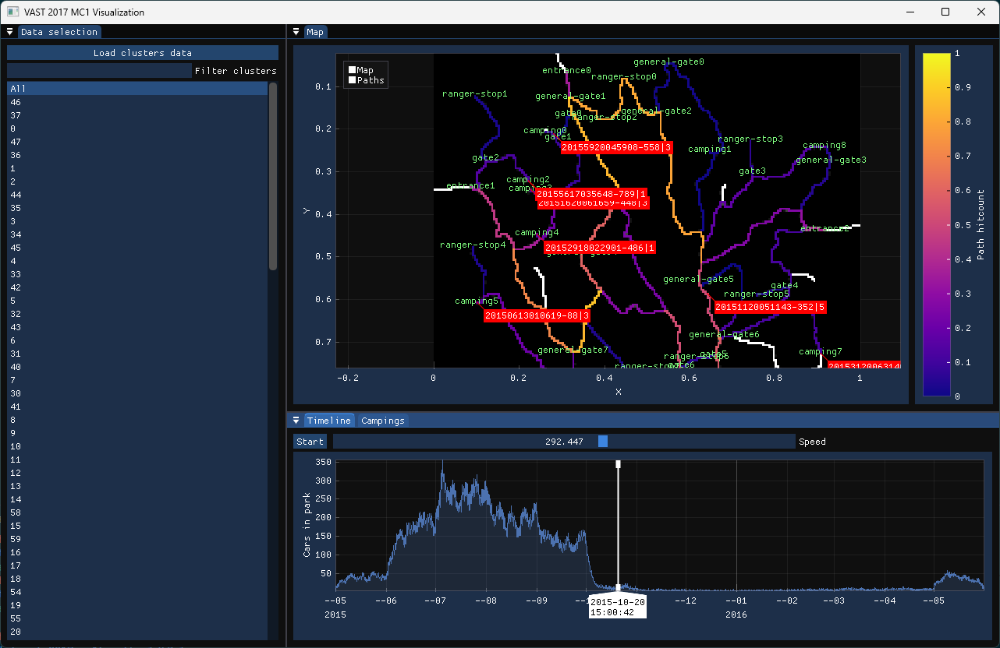

# Программа для визуализации данных VAST 2017 MC 1



## Функциональность

 - Визуализация передвижений машин
 - Визуализация наиболее частых маршрутов
 - Фильтрация данных по кластерам
 - Таблицы с пребывающими в кемпинге машинами

## Сборка

Сборка стандартная для CMake проекта, но необходимо убедиться, что git submodules подтянуты. Все необходимые проекту зависимости находятся в `libs`

```bash
git clone --recursive https://github.com/R3dKar/vast-2017-mc1.git
cd vast-2017-mc1/gui
mkdir build
cd build
cmake .. -DCMAKE_BUILD_TYPE=Release
cmake --build . --config Release --parallel
```
